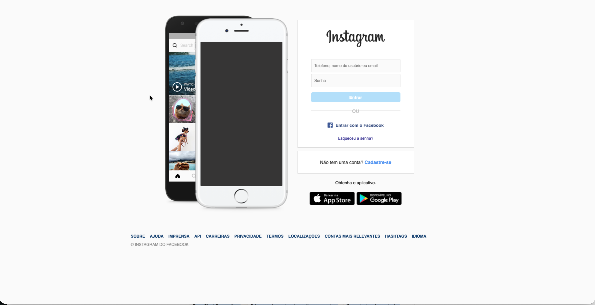

# Instagram Login Clone

A CSS practice project — recreating the Instagram login page using only HTML5 and CSS3, with no frameworks or JavaScript.

> **To add the screenshot:** open `index.html` in your browser, take a screenshot, save it as `img/preview.png`, and the image above will appear automatically.

## Features

- Login form with username, password, and submit button
- "Login with Facebook" link with icon
- Register and "Get the app" sections
- Responsive layout — banner hidden and borders removed on mobile
- Footer with navigation links

## Built with

- Semantic HTML5 (`<main>`, `<footer>`, `<nav>`, `<form>`)
- Flexbox layout
- CSS `position` and pseudo-elements for the separator
- Responsive design with media query (`max-width: 450px`)

## How to run

No build step needed. Just open `index.html` in any browser.
